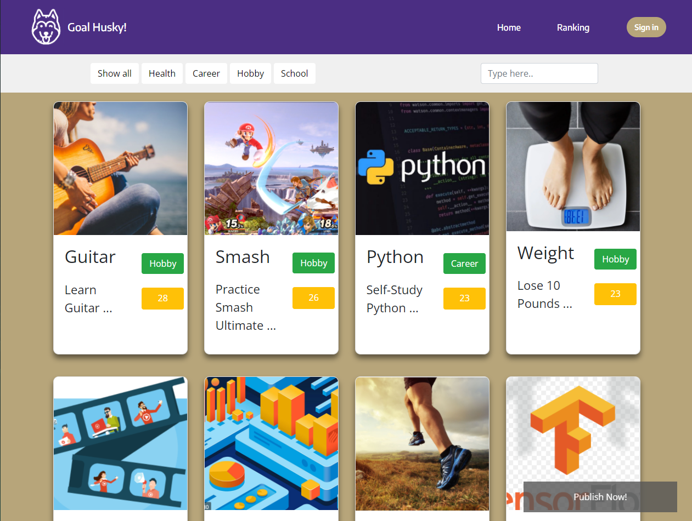
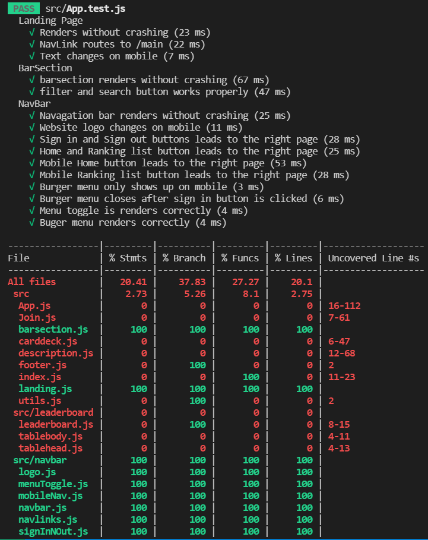

# Goal Husky!

<figure>

<figcaption align="center"> <b>A Screenshot of the  Goal Husky Home Page</b> </figcaption>



<figcaption align="center"> <b>Figure 1: Goal Husky Home Page</b> </figcaption>

</figure>

This repository contains code for an interactive web app, created for the _Client-Side Web Development_ course at the UW iSchool.

Goal Husky is a web app designed to help people find people with the same goals and work towards it together. Such as learning to play guitar, losing weight, and trying a different diet.

The web app contains a landing page, a sign in page, a home page where goals are presented in the form of cards, and a ranking/leaderboard page where the goals are ranked by the number of participants. You will also be directed to a description page if you click on any goal card in the main page. Finally, a new goal could be added through clicking the "Publish Now!" button on the home page.

The Home page is shwon in Figure 1.

The site can be viewed at <https://goal-husky.web.app/>

## Project Description

This is a React.js web application that aims to help studnets find and keep track of everyday goals with each other during the quarantine period.

Goal Husky is a website that aims to help UW students **find like-minded people** to achieve their same goal. And this project is a continuous project from project-1 contributed by Henry Bao and Johnny He.

## Code Structure Analysis

### Architectural Elements

The following table contains the architectural elements of the interactive web app.

#### Table of architectural elements

| architectural element | purpose                                                                                                                                                                                              | relationship/dependencies                                                                                                 |
| --------------------- | ---------------------------------------------------------------------------------------------------------------------------------------------------------------------------------------------------- | ------------------------------------------------------------------------------------------------------------------------- |
| React                 | The main library that enables interactive UI                                                                                                                                                         | Supports elements that change with respect to data and user interaction                                                   |
| firebase              | Provides back-end functionality                                                                                                                                                                      | Supports data-dependent elements, including: App, Access, DescriptionPage, AddGoalForm, index, Join                       |
| index                 | Initialize Firebase, renders the App element                                                                                                                                                         | Dependent on App, firebase                                                                                                |
| App                   | Renders the whole web app                                                                                                                                                                            | Dependent on React, firebase, DescriptionPage, leaderboard, CarDeck, BarSection, AddGoalForm, LandingPage, NavBar, Footer |
| DiscriptionPage       | Renders the description page for goals                                                                                                                                                               | Dependent on Join                                                                                                         |
| Join                  | Renders the join information in the description page, including days left to finish the goal, contact information, the number of participants, and a button for user to join the pursue of this goal | Supports DiscriptionPage                                                                                                  |
| leaderboard           | Randers the leader board in the Ranking tab                                                                                                                                                          | Dependent on tablebody and tablehead                                                                                      |
| tablebody             | Renders the body of the table in leader board                                                                                                                                                        | Supports leaderboard                                                                                                      |
| tablehead             | Renders the heading of the table in leader board                                                                                                                                                     | Supports leaderboard                                                                                                      |
| NavBar                | Renders the navigation bar, including Logo, Home, Ranking, and the Sign-in button. Under mobile mode, Logo changes, Home, Ranking, and Sign-in will be hidden in a burger menu.                      | Dependent on Logo, Navlinks, Access, and Burger                                                                           |
| Logo                  | Renders the logo in navigation bar. Changes when user enter mobile mode                                                                                                                              | Supports NavBar                                                                                                           |
| NavLinks              | Renders the links in navigation bar. Disappears when the user enter mobile mode                                                                                                                      | Supports NavBar                                                                                                           |
| Burger                | Renders the burger menu in mobile mode. Only shows up in mobile mode                                                                                                                                 | Supports NavBar, Dependent on MenuToggle and Access                                                                       |
| MenuToggle            | Animates the burger menu button's on-click effect                                                                                                                                                    | Supports Burger menu                                                                                                      |
| Access                | Renders login button, handles login/logout                                                                                                                                                           | Supports NavBar and Burger menu                                                                                           |
| CardDeck              | The container for cards                                                                                                                                                                              | Aggregated by Card elements                                                                                               |
| Card                  | Renders a card that represents a goal                                                                                                                                                                | Supports CardDeck                                                                                                         |
| BarSection            | Renders filter bar and search bar                                                                                                                                                                    | Supports App                                                                                                              |
| AddGoalForm           | Renders the form for adding goal, handles adding goal                                                                                                                                                | Supports App                                                                                                              |
| Footer                | Renders footer                                                                                                                                                                                       | Supports App                                                                                                              |
| LandingPage           | Randers landing page                                                                                                                                                                                 | Supports App                                                                                                              |

#### Structure Diagram

Figure 2 is the structure diagram of this codebase, drawn in UML class diagram format. It is contained in this report for better visualization of the code base's architectual elements.

</br>

<figure>

<figcaption align ="center"> <b>A structure diagram of Goal Husky in UML class diagram format</b> </figcaption>


<figcaption align ="center"> <b>Figure 2: Structure Diagram for Goal Husky</b> </figcaption>

</figure>


### Process Flow

_This is a list of actions and the corresponding process flow_

| User Action                          | Process Flow                                                                                                                                                                                                                                                                                                                                                           |
| ------------------------------------ | ---------------------------------------------------------------------------------------------------------------------------------------------------------------------------------------------------------------------------------------------------------------------------------------------------------------------------------------------------------------------- |
| Visits page                          | **App -> renders App -> renders LandingPage** <br/> When the user visits our web app, App renders itself and then renders LandingPage                                                                                                                                                                                                                                  |
| Clicks the redirect button           | **LandingPage -> renders BarSection <br/> LandingPage -> renders CardDeck <br/> LandingPage -> renders AddGoalForm <br/> LandingPage -> changes path at App -> App renders NavBar** <br/> When the user clicks the redirect button on the LandingPage, then the LandingPage changes path and calls App, App then renders NavBar, BarSection, CardDeck, and AddGoalForm |
| Clicks "Publish Now!"                | **AddGoalForm -> re-renders and opens the form** <br/> On home page, when the user clicks "Publish Now!", AddGoalForm re-renders and opens the form on the page, allowing the user to input information                                                                                                                                                                |
| Files out the form and clicks "Send" | **AddGoalForm -> saves user's goal into the database -> renders the success message** <br> After the user fills in the information in the goal form, the user clicks "Send", then AddGoalForm saves user's goal into the database, re-renders itself, and shows a success message                                                                                      |
| Clicks "Close"                       | **AddGoalForm -> re-renders and closes the form** <br> When the user clicks the "Close" button, AddGoalForm re-renders and closes the form                                                                                                                                                                                                                             |

#### Process Flow Diagram

Figure 3 is a process flow diagram of this codebase, drawn in UML sequence diagram format. It shows the process flow for the following user actions: Opening Goal Husky, directing from landing page to main page, and adding a new goal through goal form.

</br>

<figure>

<figcaption align ="center"> <b>A process flow diagram for opening Goal Husky and adding a goal</b> </figcaption>


<figcaption align ="center"> <b>Figure 3: Process Flow Diagram</b> </figcaption>

</figure>


## Architecture Assessment & Refactoring

### Element to Assess -- NavBar

We chose to **assess** and **refactor** the NavBar component because of its importance and complexity. First, NavBar is an inseparable component for every page of the web app. It is essential in enabling users to navigate between pages and signing into their accounts. On the other hand, the NavBar changes significantly when the window width goes below 768 pixels. The changes include logo changing and replacing NavLinks with a burger menu. What's more, there are also codes that handle user's sign-in status and the animation for clicking menu button.

**Functions**: Access, Logo, NavLinks, Burger, MenuToggle

**This is a table for some of the code smells, documentation, readability concerns, standards violations and design quality deficiencies in the NavBar element**

| #   | Location                  | Problem                                                                                                                                                                                                  | Refactor                                                                                                                                                     |
| --- | ------------------------- | -------------------------------------------------------------------------------------------------------------------------------------------------------------------------------------------------------- | ------------------------------------------------------------------------------------------------------------------------------------------------------------ |
| 1   | The Access function       | The mysterious function name - "Access" is confusing, making it hard to understand the purpose of the function. For example, access could mean the access to any page or elements.                       | Use "SignInNOut" instead of "Access"                                                                                                                         |
| 2   | The Logo function         | Duplicated Code in \<LogoWrapper>. The wrapper contains two \<LogoImg> elements and only one will present depending on if the screen is mobile size. The code for these two elements are highly similar. | Add a logical element to eliminate the need for duplicating codes                                                                                            |
| 3   | The App & NavBar function | Primitive Obsession - the bottonWord element uses a string to determine the sign-in status of the user, which could be confusing and inefficient.                                                        | Use a boolean instead of a string to represent the binary status                                                                                             |
| 4   | The App & NavBar function | The mysterious element name - "buttonWord" is making it harder to understand the purpose of this element.                                                                                                | Use "signInStatus" instead and then change the word that shows up accordingly as this element is passed to a differnt function                               |
| 5   | The App & NavBar function | Shotgun Surgery - "bottonWord". Changing this element requires change in a lot of little edits in different classes                                                                                      | By replacing the string "bottonWord" with boolean "signInStatus", we can change the displayed text in the leaf classes, which reduce the cupling of the code |
| 6   | The Access function       | Feature Envy - handleSignout(). This const function relies more on outer text element rather than modules from the Access function                                                                       | Instead of passing 'event' as attribute, use "signInStatus" from props in the Access function                                                                |

## Unit Tests

### Coverage Report

We decided to assess and refactor the NavBar component with the help of some Unit tests. In addition, we also covered BarSection and LandingPage. The test names and the coverage report are shwon in Figure 4.

<figure>

<figcaption align = "center"> <b>A screenshot of the Unit Test results and the Coverage Report</b> </figcaption>



<figcaption align = "center"> <b>Figure 4: Unit Tests Coverage Report</b> </figcaption>

</figure>

### Running Unit Tests

The unit test is built using the [Jest](https://facebook.github.io/jest/) tester. In order to run the test please enter the following lines into your terminal

```bash
# Move to the project directory
cd project-2

# Install all the necessary packages
npm install

# Run the test
npm run test

# for coverage results
npm run test -- --coverage --watchAll
```

## Original Project Author

This is an info 340 group project contribute by Group - C1:<br>

Henry Bao, Johnny He, Leo Fang, Lesi Li.
