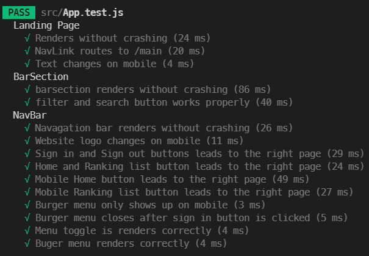

# Goal Husky!

This repository contains code for an interactive web app, created for the _Client-Side Web Development_ course at the UW iSchool.

The site can be viewed at <https://goal-husky.web.app/>

## Project Description

This is a React.js web application that aims to help studnets find and keep track of everyday goals with each other during the quarantine period.

Goal Husky is a website that aims to help UW students **find like-minded people** to achieve their same goal. And this project is a continuous project from project-1 contributed by Henry Bao and Johnny He.

## Code Structure Analysis

### Architectural Elements

The following table contains the architectural elements of the interactive web app.

#### Table of architectural elements

| architectural element | purpose                                               | relationship/dependencies                                                                                                 |
| --------------------- | ----------------------------------------------------- | ------------------------------------------------------------------------------------------------------------------------- |
| React                 | The main library that enables interactive UI          | Supports elements that change with respect to data and user interaction                                                   |
| firebase              | Provides back-end functionality, stores user information                       | Supports data-dependent elements                                                                                          |
| index                 | Initialize Firebase, renders the App element          | Dependent on App, firebase, firebase                                                                                      |
| App                   | Renders the app                                       | Dependent on React, firebase, DescriptionPage, leaderboard, CarDeck, BarSection, AddGoalForm, LandingPage, NavBar, Footer |
| DiscriptionPage       | Renders the description page for goals                | Dependent on Join                                                                                                         |
| Join                  | Renders the join information in the description page  | Supports DiscriptionPage                                                                                                  |
| leaderboard           | Randers the leader board in the Ranking tab           | Dependent on tablebody and tablehead                                                                                      |
| tablebody             | Renders the body of the table in leader board         | Supports leaderboard                                                                                                      |
| tablehead             | Renders the heading of the table in leader board      | Supports leaderboard                                                                                                      |
| NavBar                | Renders the navigation bar                            | Dependent on Logo, Navlinks, Access, and Burger                                                                           |
| Logo                  | Renders the logo in navigation bar                    | Supports NavBar                                                                                                           |
| NavLinks              | Renders the links in navigation bar                   | Supports NavBar                                                                                                           |
| Burger                | Renders the burger menu in mobile size                | Supports NavBar, Dependent on MenuToggle and Access                                                                       |
| MenuToggle            | Animates the burger menu Button                       | Supports Burger menu                                                                                                      |
| Access                | Renders login button, handles login/logout            | Supports NavBar and Burger menu                                                                                           |
| CardDeck              | Container for cards                                   | Aggregated by Card elements                                                                                               |
| Card                  | Renders a card that represents a goal                 | Supports CardDeck                                                                                                         |
| BarSection            | Renders filter bar and search bar                     | Supports App                                                                                                              |
| AddGoalForm           | Renders the form for adding goal, handles adding goal | Supports App                                                                                                              |
| Footer                | Renders footer                                        | Supports App                                                                                                              |
| LandingPage           | Randers landing page                                  | Supports App                                                                                                              |

#### Structure Diagram

This is the structure diagram of this codebase, drawn in UML format.

</br>


### Process Flow

_This is a list of actions and the corresponding process flow_

| User Action                          | Process Flow                                                                                                                                                                    |
| ------------------------------------ | ------------------------------------------------------------------------------------------------------------------------------------------------------------------------------- |
| Visits page                          | App -> renders App -> renders LandingPage                                                                                                                                       |
| Clicks the redirect button           | LandingPage -> renders BarSection <br/> LandingPage -> renders CardDeck <br/> LandingPage -> renders AddGoalForm <br/> LandingPage -> changes path at App -> App renders NavBar |
| Clicks "Publish Now!"                | AddGoalForm -> re-renders and opens the form                                                                                                                                    |
| Files out the form and clicks "Send" | AddGoalForm -> saves user's goal into the database -> renders the success message                                                                                               |
| Clicks "Close"                       | AddGoalForm -> re-renders and closes the form                                                                                                                                   |

#### Process Flow Diagram

This is the process flow diagram of this codebase, drawn in UML format.

</br>


## Architecture Assessment & Refactoring

TODO:

For any of the following, 1) identify approximate location -- which function is it in, 2) give a short 1-sentence explanation of what the problem is -- this could be a list or table

- Code Smells
- Documentation/Readability Concerns
- Standards Violations (syntax standards like HTML specification for React apps)
- Design Quality Deficiencies

TODO:

- Fix **all** identified problems in the chosen element
- A description of how you fixed the problem in a few words (with names in _Fowler's Refactoring Catalogue_) -- could combine this part with the **code smell** table.

### Element to Assess -- NavBar

Functions: Access, Logo, NavLinks, Burger, MenuToggle

**This is a table for some of the code smells, documentation, readability concerns, standards violations and design quality deficiencies in the NavBar element**
|#|Location| Problem | Fixes |
|--|--|--|--|
|1|The Access function| The mysterious function name - "Access" is confusing, making it hard to understand the purpose of the function. For example, access could mean the access to any page or elements.| Use "SignInNOut" instead of "Access"|
|2|The Logo function |Duplicated Code in \<LogoWrapper>. The wrapper contains two \<LogoImg> elements and only one will present depending on if the screen is mobile size. The code for these two elements are highly similar. | Add a logical element to eliminate the need for duplicating codes|
|3|The NavBar function| Primitive Obsession - the bottonWord element uses a string to determine the sign-in status of the user, which could be confusing and inefficient.|Use a boolean instead of a string to represent the binary status |
|4|The NavBar function| The mysterious element name - "buttonWord" is making it harder to understand the purpose of this element.| Use "signInStatus" instead and then change the word that shows up accordingly as this element is passed to a differnt function |
|5|The NavBar function| Shotgun Surgery - "bottonWord". Changing this element requires change in a lot of little edits in different classes| In addition to using "signInStatus" to replace "bottonWord", we add a new element called "statusWord" to store and manage the appearing text that corresponds to the signInStatus. <br/> For example, if we want to show the text "Login" instead of "Sign in", we only need to make changes to statusWord. |
|6|The Access function | Feature Envy - handleSignout(). This const function relies more on outer text element rather than modules from the Access function| Instead of passing 'event' as attribute, use "signInStatus" from props in the Access function|

## Unit Tests
| Test | Reason for the test |
|------|---------------------|
|      |                     |
|      |                     |
|      |                     |
|      |                     |
|      |                     |
|      |                     |
|      |                     |
|      |                     |
|      |                     |
|      |                     |
|      |                     |
|      |                     |
### Coverage Report




### Running Unit Tests

The unit test is built using the [Jest](https://facebook.github.io/jest/) tester. In order to run the test please enter the following lines into your terminal

```bash
# Move to the project folder
cd project-2

# Install all the necessary packages
npm install

# Run the test
npm run test

# Run the test with coverage report
npm run test -- --coverage
```

## Refactoring the Code
| Deficient Code | Refactored Code | Type of Architectural Deficiencies | How it was fixed |
|----------------|-----------------|------------------------------------|------------------|
|                |                 |                                    |                  |
|                |                 |                                    |                  |
|                |                 |                                    |                  |
|                |                 |                                    |                  |
|                |                 |                                    |                  |
|                |                 |                                    |                  |
|                |                 |                                    |                  |
## Original Project Author

This is an info 340 group project contribute by Group - C1:<br>

Henry Bao, Johnny He, Leo Fang, Lesi Li.
