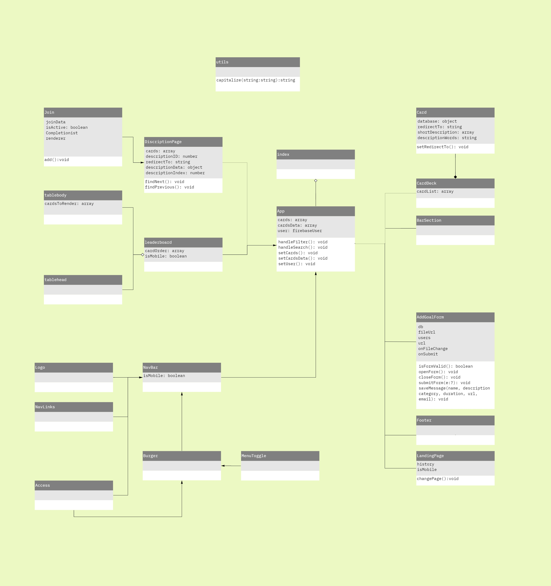
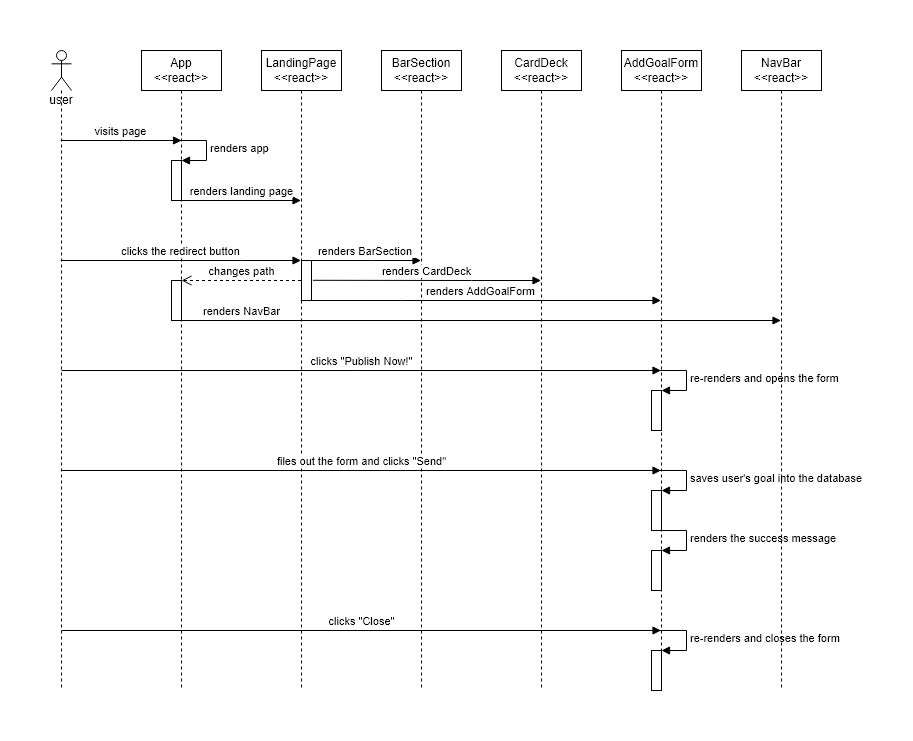

# Goal Husky!

This repository contains code for an interactive web app, created for the _Client-Side Web Development_ course at the UW iSchool.

  

The site can be viewed at <https://goal-husky.web.app/>

  

## Project Description

This is a React.js web application that aims to help studnets find and keep track of everyday goals with each other during the quarantine period.

  

Goal Husky is a website that aims to help UW students **find like-minded people** to achieve their same goal. And this project is a continuous project from project-1 contributed by Henry Bao and Johnny He.

  
## Code Structure Analysis


### Architectural Elements

TODO:
* **Identify** each architectural element and state its **purpose**, include external libraries as well, e.g. React
* Identify the **relationships/dependencies** between elements
* The above text descriptions could be in the form of a table + introductory text

#### Table of architectural elements
| architectural element| purpose | relationship/dependencies |
|--|--|-- |
| React | The main library that enables interactive UI | Supports elements that change with respect to data and user interaction |
| firebase| Provides back-end functionality| Supports data-dependent elements |
| index | Initialize Firebase, renders the App element | Dependent on App, firebase, firebase |
| App   | Renders the app | Dependent on React, firebase, DescriptionPage, leaderboard, CarDeck, BarSection, AddGoalForm, LandingPage, NavBar, Footer |
| DiscriptionPage | Renders the description page for goals | Dependent on Join|
| Join | Renders the join information in the description page | Supports DiscriptionPage |
| leaderboard | Randers the leader board in the Ranking tab | Dependent on tablebody and tablehead|
| tablebody | Renders the body of the table in leader board | Supports leaderboard|
| tablehead | Renders the heading of the table in leader board | Supports leaderboard |
| NavBar | Renders the navigation bar | Dependent on Logo, Navlinks, Access, and Burger |
| Logo | Renders the logo in navigation bar | Supports NavBar |
| NavLinks | Renders the links in navigation bar | Supports NavBar |
| Burger | Renders the burger menu in mobile size | Supports NavBar, Dependent on MenuToggle and Access|
| MenuToggle | Animates the burger menu list| Supports Burger menu |
| Access | Renders login button, handles login/logout | Supports NavBar and Burger menu |
| CardDeck | Container for cards | Aggregated by Card elements |
| Card | Renders a card that represents a goal | Supports CardDeck|
| BarSection | Renders filter bar and search bar | Supports App|
| AddGoalForm | Renders the form for adding goal, handles adding goal | Supports App |
| Footer | Renders footer | Supports App|
| LandingPage | Randers landing page | Supports App |


#### Structure Diagram

This is the structure diagram of this codebase, drawn in UML format.

</br>




### Process Flow
TODO:
* use a list of steps to describe the process flow  + introductory text
#### Process Flow Diagram

This is the process flow diagram of this codebase, drawn in UML format.

</br>




## Architecture Assessment

TODO:
* Whcih **single sizeable element** are we analyzing?

For any of the following, 1) identify approximate location -- which function is it in, 2) give a short 1-sentence explanation of what the problem is  -- this could be a list or table
* Code Smells
* Documentation/Readability Concerns
* Standards Violations (syntax standards like HTML specification for React apps)
* Design Quality Deficiencies
  
  

## Unit Tests

TODO: 
* Fix Unit Tests -- ask TA or Joel if we need to cover the App.js
* A written discussion of what aspects of your code you choose to *test* and *why* -- could be a list or a table
* Documentation of test coverage and tests passing -- screenshot

### Running Unit Tests
The unit test is built using the [Jest](https://facebook.github.io/jest/) tester. In order to run the test please enter the following lines into your terminal

```bash

# Install all the necessary packages

npm install

  

# Run the test

npm run test

```

  
 ## Refactoring

TODO:
* Fix **all** identified problems in the chosen element
* A description of how you fixed the problem in a few words (with names in *Fowler's Refactoring Catalogue*) -- could combine this part with the **code smell** table.

## Original Project Author

This is an info 340 group project contribute by Group - C1:<br>

Henry Bao, Johnny He, Leo Fang, Lesi Li.